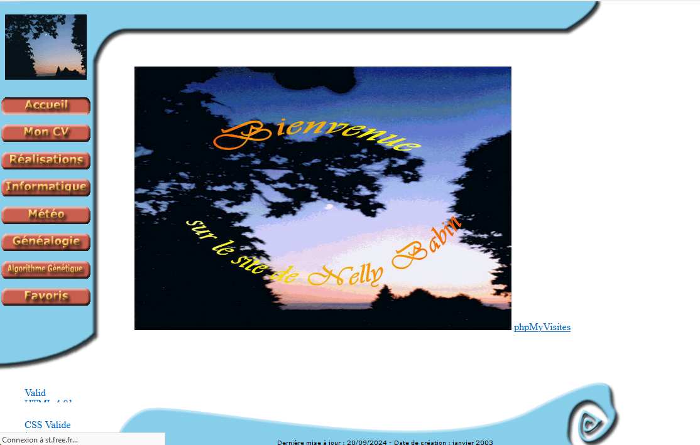
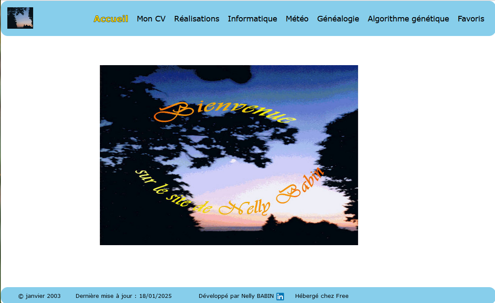
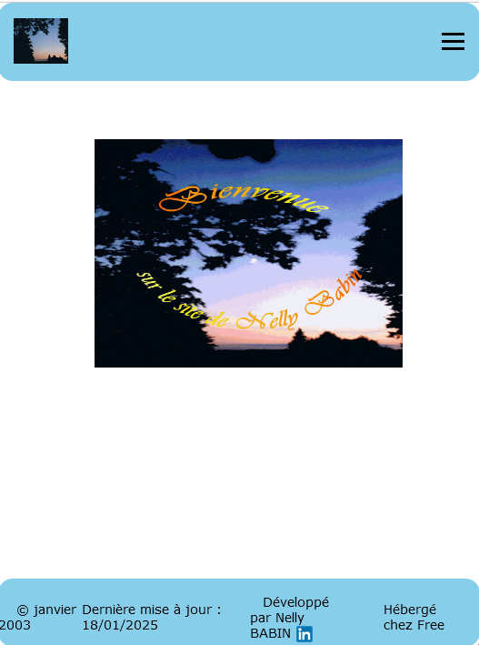

# <h1>☀️ Refonte de mon site perso ☀️</h1>
<a href="http://nelly.babin.free.fr" target="_blank" title="Mon site perso">http://nelly.babin.free.fr </a>  
 

## 1. 🚀 Introduction : Contexte et Objectif

###    • Contexte initial : 
J'ai créé ce site personnel en 2003 pour partager mes projets et expériences professionnelles. 
À l'époque, j'utilisais principalement HTML et CSS pour la mise en page, sans responsive design ni prise en charge des appareils mobiles. 
En 2006, après ma formation PAO au Greta, j'ai amélioré le design du site.  
En 2021, j'ai remplacé les animations en flash par des images. 
Le contenu du site a évolué aux cours de ces années.

###    • Objectif de la mise à jour : 
Le site devenait obsolète, difficile à maintenir et n'était pas adapté aux standards modernes du web.  
Je souhaitais le rendre plus attrayant, accessible et facile à naviguer sur tous les appareils.
 

## 2. 🔭 Évaluation de l'état du site précédent
###    • Technologies obsolètes :
        ◦ Mon site utilisait des technologies comme des tables HTML, Flash pour la mise en page et un design fixe. 
        Ces technologies sont désormais dépassées et incompatibles avec la plupart des navigateurs modernes.
        ◦ Le design était rigide et ne s'adaptait pas aux différentes tailles d'écran.
 

## 3. 🛠️ Les changements apportés
###    • Design et interface :
        ◦ Révision totale de l'apparence : un design moderne et épuré, l'utilisation de couleurs et de polices actuelles.
        ◦ Intégration d'un design responsive pour s'adapter à tous les appareils (ordinateurs, tablettes, smartphones).
        ◦ J'ai utilisé des techniques modernes comme les flexbox et grid layout pour la mise en page.
###    • Technologies modernisées :
        ◦ Le site utilise désormais HTML5 pour les balises sémantiques et CSS3 pour une meilleure gestion des animations et transitions, ainsi que JavaScript actuel.
###    • Optimisation mobile :
        ◦ Assurez-vous que le site est pleinement responsive, ce qui permet une expérience fluide sur tous types de périphériques.
        ◦ J'ai utilisé des techniques modernes comme les flexbox et grid layout pour la mise en page.
 
<a href="https://github.com/nelbab/refonte-site-perso/blob/main/changements.md" target="_blank" title="détail des changements">Détail des changements </a>   

## 4.🖥️ Comparaison avant/après
###    • Visuels :
        ◦ Voici des captures d'écran de la version 2006, et ci-dessous, la nouvelle version du site après la mise à jour.
🎴Ecran ancien site 

 
🎴Ecran nouveau site desktop et mobile 

  

## 5. 🎯 Conclusion et perspectives
###    • Bilan de la mise à jour :
        ◦ La refonte a permis d'offrir une meilleure expérience utilisateur, de sécuriser le site et d'améliorer sa visibilité sur le web.
###    • Prochaines étapes :
        ◦ Il me reste à prendre en compte l'accessibilité en ajoutant des textes alternatifs aux images, en optimisant les contrastes et en permettant la navigation au clavier.
        ◦ Je prévois de créer un portfolio au site pour partager mes projets récents et mes réflexions professionnelles.

 

## <h2> 🛠️ Technologies utilisées : </h2>

 
  
  
  
  
  
 

   

 
 
