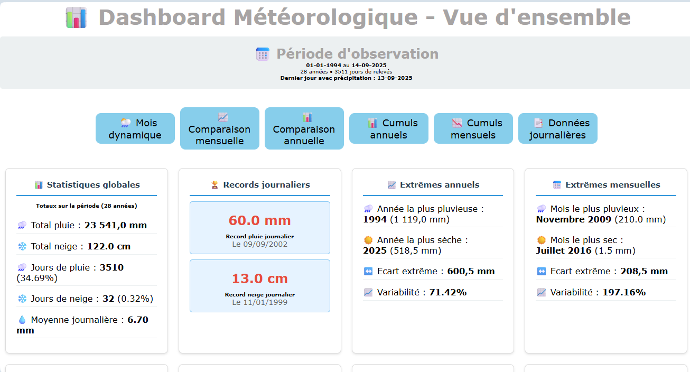

# 🌦️ Dashboard Météo

Un tableau de bord interactif permettant de visualiser et analyser des données météorologiques (pluie, neige, jours secs, répartitions saisonnières) à travers une interface claire, responsive et orientée data-visualisation.

---

## 1. 🎯 Objectifs

- Fournir une **interface ergonomique et responsive** pour l’exploration de données météo.  
- Mettre en œuvre des **statistiques multi-niveaux** : globales, journalières, mensuelles, annuelles et saisonnières.  
- Appliquer des **bonnes pratiques de data engineering** (requêtes `SQL` optimisées, organisation en cartes modulaires).  
- Illustrer mes compétences en **conception d’interfaces analytiques** et en **visualisation de données**.  

---

## 2. 🛠️ Stack technique

### Frontend
- **HTML5 sémantique** pour structurer le contenu.  
- **CSS Grid** pour la mise en page responsive et modulaire.  
- **Chart.js** pour afficher les graphiques.   
- **Système de cartes (`dashboard-card`)** permettant de réorganiser ou étendre facilement le dashboard.  
- Optimisation responsive (desktop / tablette / mobile).  

### Backend
- **PHP** côté serveur pour générer dynamiquement le contenu.  
- **Connexion à MySQL** pour extraire les données météo stockées dans la table `precipitations`.  
- Requêtes `SQL` pour agréger, filtrer et analyser les données (totaux, moyennes, extrêmes).  

### Données
- Table `precipitations` contenant :  
  - `date` : jour de mesure  
  - `quantite_mm` : quantité de pluie en millimètres  
  - `neige_cm` : quantité de neige en centimètres  

---

## 3. 📊 Fonctionnalités & Statistiques

### Statistiques globales
- Nombre total de jours enregistrés.  
- Nombre de jours de pluie, neige, sans précipitations.  
- Totaux de pluie et neige cumulés.  
- Moyennes quotidiennes.  

### Records et extrêmes
- **Records journaliers** : jour le plus pluvieux, jour le plus neigeux.  
- **Extrêmes annuels** : années les plus sèches et les plus humides.  
- **Extrêmes mensuels** : mois les plus arrosés, mois les plus neigeux.  

### Répartition saisonnière
- Comparaison de la distribution pluie/neige selon les saisons.  
- Carte occupant **deux lignes dans la grille** pour mettre en valeur les graphiques.  

### Séries temporelles
- Données cumulées annuelles.  
- Tendances récentes (analyse des derniers mois).  
- Historique sur 10 ans. 
- Evolution des 5 dernières années 
- Statistiques avancées (anomalies, ratios, pourcentages).  

### Bloc entête
- Période d'étude
- Nombre d'années
- Nombre de jours avec relevé
- Années absentes
- Dernier jour relevé

---

## 4. Gestion des années sans données

Certaines années n'ont aucune données disponible.  
Afin de conserver une continuité dans les séries temporelles et éviter des erreurs d’analyse, le dashboard applique les règles suivantes :

- Les années sans données sont **identifiées et exclues** des calculs statistiques (moyennes, records, répartitions). 
- Cette approche permet d’éviter de fausser les moyennes annuelles ou saisonnières en attribuant une valeur nulle là où il n’y a simplement pas de donnée.  
- Le traitement est dynamique : si de nouvelles données sont ajoutées ultérieurement, l’année est automatiquement intégrée aux calculs.
```
// Récupération des années disponibles dans la table
$sqlAnnees = "
    SELECT DISTINCT YEAR(date) AS annee
    FROM precipitations
    WHERE date IS NOT NULL
    ORDER BY annee ASC
";
$resultAnnees = mysql_query($sqlAnnees, $connect);
$listeAnneesDisponibles = array();

while ($row = mysql_fetch_assoc($resultAnnees)) {
    $listeAnneesDisponibles[] = (int)$row['annee'];
}

// Génération de la plage complète entre année min et max
$anneeMin = min($listeAnneesDisponibles);
$anneeMax = max($listeAnneesDisponibles);

for ($annee = $anneeMin; $annee <= $anneeMax; $annee++) {
    if (!in_array($annee, $listeAnneesDisponibles)) {
        // Traitement des années vides
        // => Exclusion des calculs statistiques
        // => Affichage comme période "sans données"
        echo "<div class='dashboard-card empty'>Année $annee : aucune donnée</div>";
    }
}
```
## 5. 🧩 Exemple de mise en page

### Grille CSS
```
.dashboard-grid {
    display: grid;
    grid-template-columns: repeat(auto-fit, minmax(300px, 1fr));
    gap: 20px;
    margin: 20px 10px;
}

.dashboard-grid .repartition-saisonniere {
    grid-row: span 2; /* occupe deux lignes pour mettre en avant les stats */
}
```
Exemple de structure `HTML`
```
<!-- Répartition saisonnière -->
        <div class="dashboard-card repartition-saisonniere">
            <h3>⛱️ Répartition saisonnière</h3>            
            <?php foreach ($statsSaisonnieres as $saison): ?>
                <div>
                    <h6>
                        <?php 
                        // Ajout d'icônes spécifiques par saison
                        $icone_saison = '';
                        switch($saison['saison']) {
                            case 'Hiver': $icone_saison = '❄️'; break;
                            case 'Printemps': $icone_saison = '🌸'; break;
                            case 'Été': $icone_saison = '☀️'; break;
                            case 'Automne': $icone_saison = '🍂'; break;
                        }
                        echo $icone_saison . ' ' . $saison['saison']; 
                        ?>
                    </h6>
                    
                    <!-- Bloc précipitations liquides -->
                    <div class="stat-saison">
                        🌧️ <strong><?php echo number_format($saison['moyenne_pluie_saison'], 1); ?> mm</strong><br>
                        📅 <?php echo number_format($saison['jours_pluie_saison'], 1); ?> jours de pluie
                    </div>
                    
                    <!-- Bloc neige -->
                    <?php if ($saison['jours_neige_saison'] > 0): ?>
                    <div class="stat-saison">
                        ❄️ <strong><?php echo number_format($saison['moyenne_neige_saison'], 1); ?> cm</strong><br>
                        📅 <?php echo number_format($saison['jours_neige_saison'], 1); ?> jours de neige
                    </div>
                    <?php endif; ?>
                    
                    <!-- Bloc jours secs -->
                    <div class="stat-saison">
                        ☀️ <?php echo number_format($saison['jours_secs_saison'], 1); ?> jours secs
                    </div>

                    <!-- Pourcentages -->
                    <?php 
                    $total_jours_precip = $saison['jours_pluie_saison'] + $saison['jours_neige_saison'];
                    $total_jours_saison = $saison['jours_total_theo_saison'];
                    $pourcentage_precip = $total_jours_saison > 0 ? ($total_jours_precip / $total_jours_saison) * 100 : 0;
                    $pourcentage_sec = $total_jours_saison > 0 ? ($saison['jours_secs_saison'] / $total_jours_saison) * 100 : 0;
                    ?>
                    <div class="stat-saison">
                        <small>
                            🌦️ <?php echo number_format($pourcentage_precip, 1); ?>% jours précipitations <br /> 
                            ☀️ <?php echo number_format($pourcentage_sec, 1); ?>% jours secs
                        </small>
                    </div>
                </div>
            <?php endforeach; ?>
        </div>
```
## 6. 🖥️ Captures d'écrans : 

🎴Ecran des nouveaux graphiques :<br />
- Dashboard météo


## 7. 🚀 Compétences mises en avant
- Base de données relationnelle :

Conception et exploitation de données météorologiques.

Ecriture de requêtes `SQL` complexes pour extractions, totaux, moyennes, records.

- Développement backend :
  
Génération dynamique de pages avec `PHP`.

- Frontend moderne : 
  
Utilisation avancée de `CSS Grid` pour une interface flexible.

- Data visualisation : 

Mise en valeur des indicateurs météo par blocs et graphiques.

## 8. 🎯 Conclusion

Ce projet de **Dashboard Météo** illustre ma capacité à :

- Concevoir et structurer une application web orientée **analyse de données**.  
- Exploiter une base de données `MySQL` pour produire des statistiques riches et variées.  
- Mettre en œuvre un **backend en `PHP`** pour générer du contenu dynamique.  
- Créer une **interface responsive moderne** grâce à **`CSS` Grid**.  
- Valoriser les résultats par une approche **data-visualisation claire et modulaire**.
- Utilisation de `Chart.js` pour afficher l'histogramme et la courbe.

Au-delà de la météo, cette architecture peut être adaptée à tout type de données temporelles (ventes, capteurs IoT, monitoring, etc.).  
Elle démontre ma polyvalence entre **backend, frontend et analyse statistique**.

Vous pouvez voir le résultat ici :<br />
<a href="http://nelly.babin.free.fr/meteo/dashboard.php" target="_blank" title="Dashboard Météorologique - Vue d'ensemble">📰 Dashboard Météorologique - Vue d'ensemble </a>