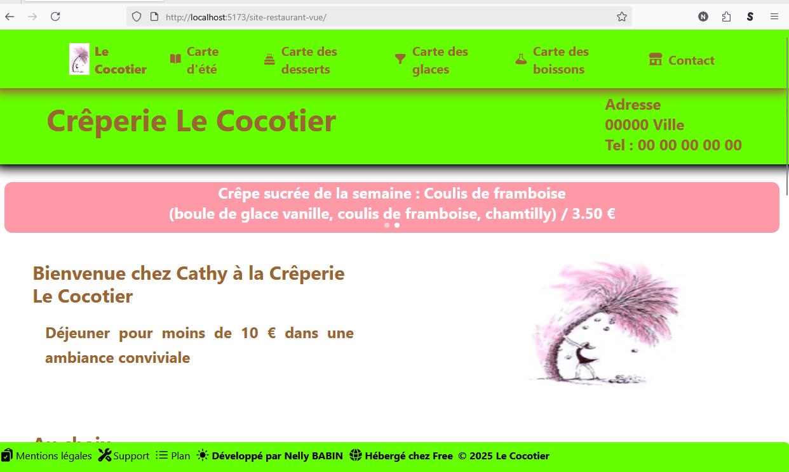

# 🌴 Fais le site de la créperie Le Cocotier en Vue js 🏝️
<br />

## 1. 🍽️ Objectifs de ce projet

- Rendre le site responsif et moderne.

- Automatiser l'apparition des cartes suivant la saison (hiver, mi-saison, été).
<br /><br />

## 2. 💡 Refonte en Vue v3 <a href="https://vuejs.org" target="_blank"></a><br />

### a. 🔭 Objectifs

- Découvrir la fonctionnement et architecture de `Vue js v3`.

### b. 🛠️ Présentation Vue js v3

- Système de templates
- Composants
- `Vue Router` pour la navigation

### c. 👩‍💻 Conception

- J'ai repris les composants du site `React`.
- J'ai adapté les composants `Material-Tailwind` en `Vue`.
- J'ai adapté le routage à `Vue`

### d. Architecture du projet

- Un composant = un dossier et un fichier.
- Pages dans un dossier "pages" et un seul fichier par page.
- <b>Routing simple</b> dans un seul fichier.

### e. 🛠️ Technologies utilisées : 
<div align="center"> 
<a href="https://www.typescriptlang.org/" target="_blank"></a>
<a href="https://vuejs.org" target="_blank"></a>
<a href="https://www.tailwindcss.com/" target="_blank"></a>
<a href="https://en.wikipedia.org/wiki/HTML5" target="_blank"></a> 
<a href="https://nodejs.org/" target="_blank"></a>
<a href="https://vite.dev/" target="_blank"></a>
<a href="https://www.w3schools.com/css/" target="_blank"></a>
<a href="https://www.npmjs.com" target="_blank"></a>
<a href="https://code.visualstudio.com/" target="_blank"></a>
<a href="https://github.com/" target="_blank"></a>
<a href="https://httpd.apache.org" target="_blank"></a>
</div>
<br />

### f. Voici le site en Vue js 3: 
  
<a href="http://nelly.babin.free.fr/site-restaurant-vue/" target="_blank" title="Page du site en Vue">Site en Vue</a>
<br /><br />


## 4. 🖥️ Captures d'écrans : 

🎴Ecran site en Vue desktop et mobile<a href="https://vuejs.org/" target="_blank"></a><br />


<br /><br />

## 5. 📝 Codes spécifiques

- Pour le routage, j'ai utilisé `vue-router`:<br /><br />
Fichier `main.ts` :
```
import { createApp } from 'vue'
import App from './App.vue'
import router from './router'
import './index.css'

createApp(App).use(router).mount('#app')
```
Fichier `App.vue` :
```
<template>
  <div id="app">
    <Header />
    <main class="min-h-screen">
      <Suspense>
        <template #default>
          <router-view />
        </template>
        <template #fallback>
          <div class="flex justify-center items-center min-h-screen">
            <div class="text-lg text-[#996633]">Chargement...</div>
          </div>
        </template>
      </Suspense>
    </main>
    <Footer />
  </div>
</template>

<script setup>
import Header from './components/layout/Header.vue'
import Footer from './components/layout/Footer.vue'
</script>
```
le fichier `\router\index.ts`
```
import { createRouter, createWebHistory, RouteRecordRaw } from 'vue-router'

// Import des composants avec lazy loading pour éviter les erreurs de chargement
const Accueil = () => import('../pages/Accueil.vue')
const CarteBoisson = () => import('../pages/CarteBoisson.vue')
const CarteDessert = () => import('../pages/CarteDessert.vue')
const CarteEte = () => import('../pages/CarteEte.vue')
const CarteGlace = () => import('../pages/CarteGlace.vue')
const CarteHiver = () => import('../pages/CarteHiver.vue')
const CarteIntermediaire = () => import('../pages/CarteIntermediaire.vue')
const Contact = () => import('../pages/Contact.vue')

const routes: Array<RouteRecordRaw> = [
  { 
    path: '/', 
    name: 'Accueil', 
    component: Accueil 
  },
  { 
    path: '/CarteBoisson', 
    name: 'CarteBoisson', 
    component: CarteBoisson 
  },
  { 
    path: '/CarteDessert', 
    name: 'CarteDessert', 
    component: CarteDessert 
  },
  { 
    path: '/CarteEte', 
    name: 'CarteEte', 
    component: CarteEte 
  },
  { 
    path: '/CarteGlace', 
    name: 'CarteGlace', 
    component: CarteGlace 
  },
  { 
    path: '/CarteHiver', 
    name: 'CarteHiver', 
    component: CarteHiver 
  },
  { 
    path: '/CarteIntermediaire', 
    name: 'CarteIntermediaire', 
    component: CarteIntermediaire 
  },
  { 
    path: '/Contact', 
    name: 'Contact', 
    component: Contact 
  },
  {
    path: '/:pathMatch(.*)*',
    redirect: '/'
  }
]

const router = createRouter({
  history: createWebHistory('/site-restaurant-vue/'),
  routes
})

// Gestion des erreurs de navigation
router.onError((error) => {
  console.error('Erreur de navigation:', error)
})

export default router
```
- Faire un <b>test</b> pour afficher un champ, le code est <b>inclus dans le composant</b> :
```
<script setup>
import { ref, onMounted, onUnmounted } from 'vue'
import BlocImage from '../components/blocImage.vue'

// Déclaration de la variable réactive
const periode = ref(1)

// Fonction pour gérer le redimensionnement
const handleResize = () => {
  // Ajoutez ici votre logique de redimensionnement si nécessaire
  console.log('Window resized')
}

// Lifecycle hooks
onMounted(() => {
  // Déterminer la période selon le mois
  const date = new Date()
  const mois = date.getMonth() + 1

  if (mois > 6 && mois < 9) {
    periode.value = 2 // Été
  } else if ([9, 10, 4, 5].includes(mois)) {
    periode.value = 3 // Mi-saison
  } else {
    periode.value = 1 // Hiver
  }

  // Écouter le redimensionnement
  window.addEventListener('resize', handleResize)
})

onUnmounted(() => {
  window.removeEventListener('resize', handleResize)
})
</script>
<template>
...
<li v-if="periode === 2">Coupe de fraise <i>(fraise, chantilly)</i> / 4.40 €</li>
...
</template>
```
- <b>Les composants sont importés directement dans le fichier qui l'utilise</b>.<br>
Modification du <b>composant</b> `blocImage`, <b>utilisable directement sur la page</b> `blocImage.vue` :
```
<script setup lang="ts">
defineProps<{
  image: string
  titre: string
  orientation?: 'h' | 'v'
}>()

const getImageUrl = (filename: string) =>
  new URL(`../assets/images/${filename}`, import.meta.url).href
</script>

<template>
  
</template>
```
Puis import et utilisation direct dans les pages l'utilisant :
```
// Import des composants
<script setup>
import BlocImage from '../components/blocImage.vue'
</script>
```
et
```
<template>
...
<BlocImage image="lecocotierp.jpg" titre="logo du Cocotier" orientation="v" />
...
</template>
```
- <b>Modification du composent `caroussel`</b> sur la page d'`Accueil.vue`  :
```
<template>
  <div class="carousel-container">
    <!-- Carousel wrapper -->
    <div class="relative rounded-xl overflow-hidden">
      <div 
        class="flex transition-transform duration-500 ease-in-out"
        :style="{ transform: `translateX(-${currentSlide * 100}%)` }"
      >
        <!-- Slide 1 -->
        <div class="relative h-20 w-full flex-shrink-0">
          <div class="absolute inset-0 grid h-full w-full place-items-center bg-[#fc6100b0]">
            <div class="w-10/12 text-center md:w-10/12">
              <h2 class="mb-12 text-2xl font-bold text-white">
                Crêpe de la semaine : LATINE : Chorizo, philadelphia, œuf, emmental / 6.20 €
              </h2>
            </div>
          </div>
        </div>

        <!-- Slide 2 -->
        <div class="relative h-20 w-full flex-shrink-0">
          <div class="absolute inset-0 grid h-full w-full place-items-center bg-[#fc002265]">
            <div class="w-10/12 text-center md:w-10/12">
              <h2 class="mb-12 text-2xl font-bold text-white">
                Crêpe sucrée de la semaine : Coulis de framboise <br />
                (boule de glace vanille, coulis de framboise, chamtilly) / 3.50 €
              </h2>
            </div>
          </div>
        </div>

        <!-- Slide 3 conditionnelle -->
        <div 
          v-if="periode === 1" 
          class="relative h-20 w-full flex-shrink-0"
        >
          <div class="absolute inset-0 grid h-full w-full place-items-center bg-[#00dffce5]">
            <div class="w-10/12 text-center md:w-10/12">
              <h2 class="mb-12 text-2xl font-bold text-white">
                Soupe de la semaine : Soupe de poissons / 3.50 €
              </h2>
            </div>
          </div>
        </div>
      </div>

      <!-- Navigation dots (optionnel) -->
      <div class="absolute bottom-2 left-1/2 transform -translate-x-1/2 flex space-x-2">
        <button
          v-for="(slide, index) in totalSlides"
          :key="index"
          @click="goToSlide(index)"
          class="w-2 h-2 rounded-full transition-colors duration-200"
          :class="currentSlide === index ? 'bg-white' : 'bg-white/50'"
        ></button>
      </div>
    </div>
  </div>
</template>

<script>
import { ref, onMounted, onUnmounted, computed } from 'vue'

export default {
  name: 'CarouselTransition',
  setup() {
    const periode = ref(1)
    const currentSlide = ref(0)
    let autoplayInterval = null

    // Calculer le nombre total de slides
    const totalSlides = computed(() => {
      return periode.value === 1 ? 3 : 2
    })

    // Initialiser la période selon le mois
    const initializePeriode = () => {
      const date = new Date()
      const mois = date.getMonth() + 1
      
      if (mois > 6 && mois < 9) {
        periode.value = 2
      } else if ([9, 10, 4, 5].includes(mois)) {
        periode.value = 3
      }
    }

    // Navigation vers une slide spécifique
    const goToSlide = (index) => {
      currentSlide.value = index
    }

    // Slide suivante
    const nextSlide = () => {
      currentSlide.value = (currentSlide.value + 1) % totalSlides.value
    }

    // Démarrer l'autoplay
    const startAutoplay = () => {
      autoplayInterval = setInterval(() => {
        nextSlide()
      }, 3000) // Change toutes les 3 secondes
    }

    // Arrêter l'autoplay
    const stopAutoplay = () => {
      if (autoplayInterval) {
        clearInterval(autoplayInterval)
        autoplayInterval = null
      }
    }

    // Lifecycle hooks
    onMounted(() => {
      initializePeriode()
      startAutoplay()
    })

    onUnmounted(() => {
      stopAutoplay()
    })

    return {
      periode,
      currentSlide,
      totalSlides,
      goToSlide,
      nextSlide
    }
  }
}
</script>

<style scoped>
/* Animation pour les slides */
.transition-transform {
  transition: transform 0.5s ease-in-out;
}
</style>
```
Puis import et utilisation direct dans la page l'utilisant :
```
<script>
// Import des composants
import CarouselTransition from '../components/Carousel.vue'

export default {
  components: {
    CarouselTransition
  }
}
</script>
```
et
```
<template>
...
<CarouselTransition />
...
</template>
```
- <b>Modification des modales pour les informations du `Footer.vue`</b>, exemple de la modale `support.vue` :
```
<template>
    <DialogBase @close="$emit('close')">
      <!-- En-tête -->
      <div class="space-x-2 h-16 w-full p-1 flex justify-center items-center bg-[#66FF00] rounded-t-lg">
      <h2 class="text-2xl font-bold text-[#996633] mb-4">Support Technique</h2>
      </div>
      <!-- Corps -->
      <div class="my-2 font-bold">
          Pour tous problèmes techniques concernant le site, merci de contacter : 
          <div className="font-bold text-black">contact.nellybabin@gmail.com</div>
      </div>
    </DialogBase>
</template>

<script setup>
  import DialogBase from './DialogBase.vue'
  const emit = defineEmits(['close'])
</script>
```
avec la création du fichier `DialogBase.vue` pour une bonne gestion des modales :
``` 
<template>
  <div class="modal-overlay" @click.self="emit('close')">
    <div class="modal-content">
      <slot />
       <!-- Pied de page -->
        <div class="space-x-2 h-16 w-full p-1 flex justify-center items-center bg-[#66FF00] rounded-b-lg">
          <button 
            @click="emit('close')"
            class="bg-[#996633] text-white px-4 py-2 rounded hover:bg-[#7a5229] transition-colors" 
            title="bouton Fermer"
          >
            Fermer
          </button>
        </div>
    </div>
  </div>
</template>

<script setup>
const emit = defineEmits(['close'])
</script>

<style scoped>
.modal-overlay {
  position: fixed;
  top: 0; left: 0;
  width: 100vw; height: 100vh;
  background-color: rgba(0, 0, 0, 0.4);
  display: flex;
  align-items: center;
  justify-content: center;
  z-index: 50;
}
.modal-content {
  background: white;
  padding: 2rem;
  border-radius: 8px;
  max-width: 90%;
}
</style>
```
Puis import et utilisation direct dans le footer l'utilisant avec une utilisation d'une icône `heroicons` :
```
<script setup>
import { ref } from 'vue'
import {
  ClipboardDocumentCheckIcon,
  GlobeAltIcon,
  ListBulletIcon,
  WrenchScrewdriverIcon,
  SunIcon,
} from '@heroicons/vue/24/solid'

// Import des composants modaux
import MentionsLegales from '../Dialog/MentionsLegales.vue'
import Support from '../Dialog/Support.vue'
import Plan from '../Dialog/Plan.vue'

const showMentions = ref(false)
const showSupport = ref(false)
const showPlan = ref(false)
</script>
```
et
```
<template>
...
<button @click="showSupport = true" class="flex items-center gap-x-0.5 hover:text-[#318d45]">
<WrenchScrewdriverIcon class="h-6 w-6" />
Support
</button>
...
</template>
```

<br />

## 6. 📝 Conclusion

### 🛠️ Résultats techniques obtenus

- **Taille du projet build** : `1,15 Mo` - un bundle optimisé et léger.
  
- **Taille après build** : `93,3 Mo` (incluant tous les fichiers générés .js après le build pour chaque composant .vue et .ts)
  
- **Performance** : Site responsive et fluide sur desktop et mobile.
  
- **Automatisation saisonnière** : Système d'affichage dynamique des menus selon les périodes (hiver, mi-saison, été)

### ✅ Objectifs atteints

- **Modernisation complète** : Migration réussie vers `Vue.js 3` avec `TypeScript`.
  
- **Responsivité** : Design adaptatif parfaitement fonctionnel sur tous les écrans.
  
- **Automatisation** : Logique saisonnière implémentée pour l'affichage des cartes.
  
- **Performance** : Lazy loading des composants et optimisation du bundle.
  
- **Expérience utilisateur** : Carousel interactif, modales élégantes et navigation fluide.

### 👩‍💻 Apprentissages et découvertes

#### a. Architecture Vue.js 3 :
- Maîtrise de la Composition API avec `<script setup>`.
- Compréhension du système de réactivité avec `ref()` et `computed()`.
- Gestion efficace du cycle de vie des composants (`onMounted`, `onUnmounted`).

#### b. Ecosystème Vue :
- Intégration fluide de `Vue Router` pour la navigation SPA.
- Utilisation de Suspense pour la gestion du chargement asynchrone.
- Implémentation de composants réutilisables (`DialogBase`, `BlocImage`, `Carousel`).

#### c. Optimisations techniques :
- `Lazy loading` des routes pour réduire le temps de chargement initial.
  
- Gestion automatique des erreurs de navigation.
  
- Architecture modulaire avec séparation claire des responsabilités.

### 🎯Points forts du projet

- **Code maintenable** : Structure claire avec un composant = un fichier.

- **Évolutivité** : Système de gestion saisonnière facilement extensible.
  
- **Performance** : Bundle optimisé et chargement différé des composants.
  
- **Accessibilité** : Utilisation d'icônes Heroicons et attributs ARIA appropriés
  
- **Expérience utilisateur** : Transitions fluides et interactions engageantes.

### 🔄 Retour d'expérience

- Ce projet a permis de découvrir la puissance et l'élégance de `Vue.js 3`.
 
- La migration depuis `React` s'est avérée fluide grâce à la philosophie similaire des composants. 
  
- L'écosystème `Vue` offre une excellente  experience avec des outils comme `Vite` pour un développement rapide et une documentation claire.

- **Temps de développement** : Environ 3 week-end pour la migration complète, les nouvelles fonctionnalités et la modification du design.
