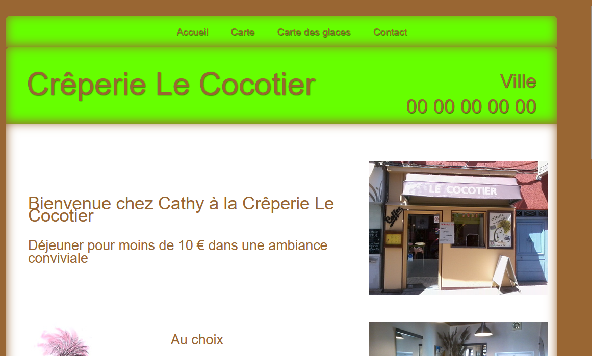
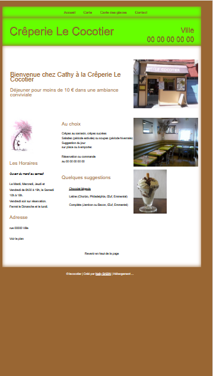
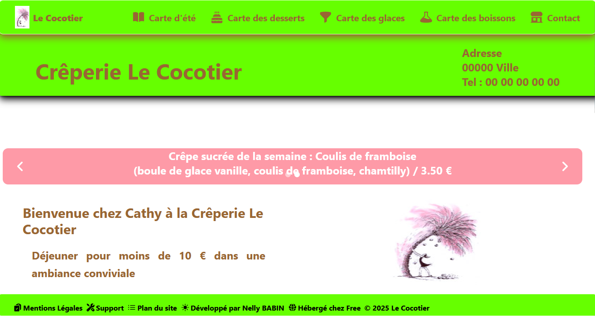
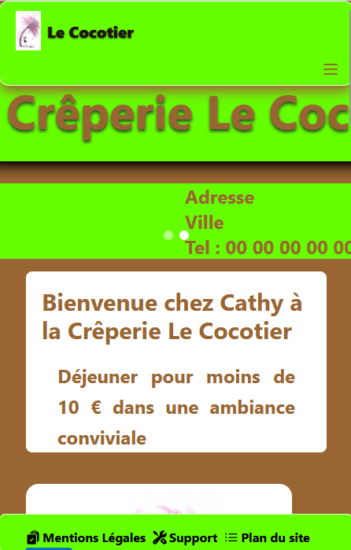
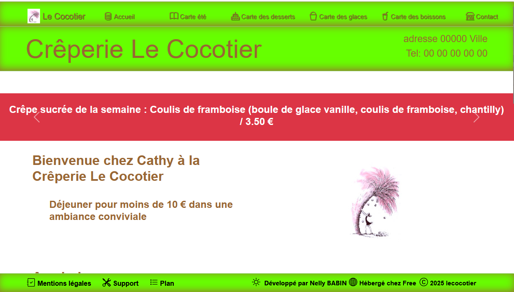
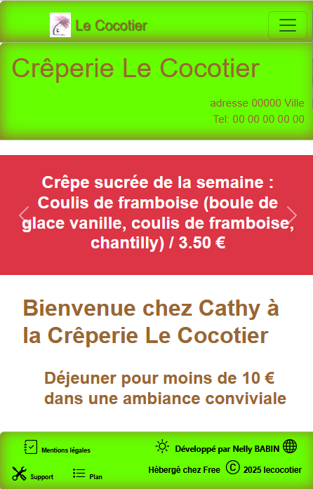

# 🌴 Refonte du site de la créperie Le Cocotier 🏝️
<br />

## 1. 🍽️ Objectifs de la refonte

- Rendre le site responsif et moderne.<br />
- Automatiser l'apparition des cartes suivant la saison (hiver, mi-saison, été).
<br /><br />

## 2. 💡 Refonte en React v19 <a href="https://reactjs.org/" target="_blank"></a><br />

### a. 🔭 Objectifs

- Découvrir les nouveautés de React v19.

### b. 🛠️ Présentation React 19 + Material Tailwind

- Bibliothèque flexible basée sur des composants
- Tailwind permet un styling modulaire et personnalisable
- Expérience développeur fluide avec les hooks et le Context API

### c. 👩‍💻 Conception

- J'ai ajouté un header et un footer.
- J'ai ajouté un carroussel pour les crêpes mises en avant.
- Utilisation de modèles Material Tailwind.
- J'ai utilisé des techniques modernes comme les flexbox et grid layout pour la mise en page et rendre le site responsif.
- J'ai créé un composant pour afficher les images.

Voir le site en React V19 
  
<a href="http://le-cocotier-react.s3-website.eu-west-3.amazonaws.com/" target="_blank" title="Page de la refonte React">Site de la refonte React</a>


### d. 🛠️ Technologies utilisées : 
<div align="center"> 
<a href="https://www.typescriptlang.org/" target="_blank"></a>
<a href="https://reactjs.org/" target="_blank"></a>
<a href="https://www.tailwindcss.com/" target="_blank"></a>
<a href="https://www.material-tailwind.com/" target="_blank"></a>
<a href="https://en.wikipedia.org/wiki/HTML5" target="_blank"></a> 
<a href="https://nodejs.org/" target="_blank"></a>
<a href="https://vite.dev/" target="_blank"></a>
<a href="https://www.w3schools.com/css/" target="_blank"></a>
<a href="https://www.npmjs.com" target="_blank"></a>
<a href="https://code.visualstudio.com/" target="_blank"></a>
<a href="https://github.com/" target="_blank"></a>
<a href="https://aws.amazon.com/" target="_blank"></a> 
</div>
<br />

### e. Voici le nouveau site en React V19 : 
  
<a href="http://le-cocotier-react.s3-website.eu-west-3.amazonaws.com/" target="_blank" title="Page de la refonte React">Site de la refonte React</a>
<br /><br />

## 3. 🔍 Refonte en Angular v19 <a href="https://angular.dev/" target="_blank"></a>

### a. 🔭 Objectifs

- Découvrir un nouveau framework et une nouvelle librairie.
- Refaire le site identique à celui fait en React.

### b. 🛠️ Présentation Angular 19 + Bootstrap 5

- Framework complet avec une architecture imposée.
- Bootstrap offre un styling rapide mais moins modulaire.
- Utilisation de services et de modules pour la gestion des données.


### c. 👩‍💻 Conception

- Recherche des modèles Boostrap de navbar pour le header, de footer, de carousel.
- Les adapter à mon site.
- Utilisation des techniques modernes comme les flexbox et grid layout pour la mise en page et rendre le site responsif.
- J'ai ajouté un carroussel pour les crêpes mises en avant.
- J'ai créé un composant pour afficher les images.

- voir le site en Angular 

<a href="http://nelly.babin.free.fr/site-restaurant" target="_blank" title="Page de la refonte Angular">Site de la refonte Angular</a>


### d. 🛠️ Technologies utilisées : 
<div align="center"> 
<a href="https://www.typescriptlang.org/" target="_blank"></a>
<a href="https://angular.dev/" target="_blank"></a>
<a href="https://getbootstrap.com/" target="_blank"></a>
<a href="https://en.wikipedia.org/wiki/HTML5" target="_blank"></a> 
<a href="https://nodejs.org/" target="_blank"></a>
<a href="https://www.w3schools.com/css/" target="_blank"></a>
<a href="https://httpd.apache.org" target="_blank"></a>
<a href="https://www.npmjs.com" target="_blank"></a>
<a href="https://code.visualstudio.com/" target="_blank"></a>
<a href="https://github.com/" target="_blank"></a> 
</div>

<br /><br />

## 4. 🖥️ Captures d'écrans : 
🎴Ecran ancien site desktop et mobile<br />


<br />
🎴Ecran site en React desktop et mobile<a href="https://reactjs.org/" target="_blank"></a><br />

<br />
🎴Ecran site en Angular desktop et mobile<a href="https://angular.dev/" target="_blank"></a><br />


<br /><br />


## 5. 📝 Comparaison entre ces solutions

### a. React avec Material Tailwind : <a href="https://reactjs.org/" target="_blank"></a><br />

- <b>Site monopage</b> idéal pour un site vitrine.
- Un composant = un dossier et un fichier.
- <b>Routing simple</b> dans un seul fichier. Ici je l'ai fait en 2 fichiers pour les changements de route.
Fichier App.tsx :
```
const App = () => {
  return (
    <>
      <Header/>
      <Routes>
      <Route path="/" element={<AccueilPage/>} />
      {routes.map((route, index) => (
        <Route key={index} path={route.path} element={route.element} /> 
      ))}
      <Route path="*" element={<Page404 />} />
      </Routes>
      <Footer/>
    </>
  );
};
export default App;
```
Fichier routes/index.tsx :
```
const routes = [
  {
    path: "/",
    element: <AccueilPage />,
  },
  {
    path: "/CarteEte",
    element: <CarteEte />,
  },
  {
    path: "/CarteHiver",
    element: <CarteHiver />,
  },
  {
    path: "/CarteIntermediaire",
    element: <CarteIntermediaire />,
  },
  {
    path: "/CarteDessert",
    element: <CarteDessert />,
  },
  {
    path: "/CarteGlace",
    element: <CarteGlace />,
  },
  {
    path: "/CarteBoisson",
    element: <CarteBoisson />,
  },
  {
    path: "/Contact",
    element: <Contact />,
  },
];
export default routes;
```
Le body du fichier index.html :
```
 <body>
    <div id="root"></div>
   <script type="module" src="/src/main.tsx"></script>
  </body>
```
- Est très <b>simple à personnaliser</b>.
- Composants réutilisables et facilement organisables.
- Hooks et Context API rendent la gestion d'état fluide
- Material Tailwind intégration naturelle.
- Faire un <b>test</b> pour afficher un champ, le code est <b>inclus dans le composant</b> :
```
const CarteDessertPage = () => {

  const date = new Date()
    const mois = date.getMonth() + 1
    const [periode, setPeriode] = useState(1);
    if (mois > 6 && mois < 9 ) setPeriode(2)
    if (mois === 9 || mois ===10 || mois === 4 || mois === 5) setPeriode(3)
...
{(periode === 2) ? (
                <li>Coupe de fraise <i>(fraise, chantilly)</i> / 4.40 €</li>
                ) :
                <div></div>}
```
- <b>Les composants sont importés directement dans le fichier qui l'utilise</b>.<br>
Création d'un <b>composant</b> "blocImage", <b>utilisable directement sur la page</b> blocImage.tsx :
```
export default function BlocImage(image: string, titre: string) {

return (
        
)}
```
Puis import et utilisation direct dans les pages l'utilisant :
```
import BlocImage from './pages/Modals/blocImage';
```
et
```
{BlocImage("lecocotierp.jpg","logo du Cocotier")}
```
- <b>Création d'un composent caroussel</b> sur la page d'accueil  :
```
export default function CarouselTransition() {
  const date = new Date()
  const mois = date.getMonth() + 1
  const [periode, setPeriode] = useState(1);
  if (mois > 6 && mois < 9 ) setPeriode(2)
  if (mois === 9 || mois ===10 || mois === 4 || mois === 5) setPeriode(3)

  return (
<Carousel
  loop={true}
  autoplay={true}
  className="rounded-xl"
  title="Carousel d'annonces"
  placeholder=""
  onPointerEnterCapture={() => {}}
  onPointerLeaveCapture={() => {}}
>
<div className="relative h-20 w-full">
  <div className="absolute inset-0 grid h-full w-full place-items-center bg-[#fc6100b0]">
<div className="w-10/12 text-center md:w-10/12">
  <Typography
    className="mb-12 text-2xl font-bold text-white"
    placeholder=""
    onPointerEnterCapture={() => {}}
    onPointerLeaveCapture={() => {}}
  >
      Crêpe de la semaine : LATINE : Chorizo, philadelphia, œuf, emmental / 6.20 €
      </Typography>
</div>
</div>
</div>
<div className="relative h-20 w-full">
<div className="absolute inset-0 grid h-full w-full place-items-center bg-[#fc002265]">
<div className="w-10/12 text-center md:w-10/12">
  <Typography
    className="mb-12 text-2xl font-bold text-white"
    placeholder=""
    onPointerEnterCapture={() => {}}
    onPointerLeaveCapture={() => {}}
  >
    Crêpe sucrée de la semaine : Coulis de framboise <br />
    (boule de glace vanille, coulis de framboise, chamtilly) / 3.50 €
    </Typography>
</div>
</div>
</div>
{(periode === 1) ? (
<div className="relative h-20 w-full">
<div className="absolute inset-0 grid h-full w-full place-items-center bg-[#00dffce5]">
<div className="w-10/12 text-center md:w-10/12">
  <Typography
    className="mb-12 text-2xl font-bold text-white"
    placeholder=""
    onPointerEnterCapture={() => {}}
    onPointerLeaveCapture={() => {}}
  >
    Soupe de la semaine : Soupe de poissons / 3.50 €
    </Typography>
</div>
</div>
</div>
) :
<div></div>}
</Carousel>
);
}
```
Puis import et utilisation direct dans la page l'utilisant :
```
import CarouselTransition from "./pages/Modals/Carousel";
```
et
```
<CarouselTransition />
```
- <b>Création de modales pour les informations du footer</b>, exemple de la modale support :
```
import React from "react";
import {
  Button,
  Dialog,
  DialogHeader,
  DialogBody,
  DialogFooter,
} from "@material-tailwind/react";
 
export function Support() {
  const [open, setOpen] = React.useState(false);
  const handleOpen = () => setOpen(!open);
 
  return (
    <>
      <a onClick={handleOpen} className="font-bold text-center" title="la boîte de dialogue Support">Support</a>
      <Dialog open={open} handler={handleOpen} id="Dialog-Support" aria-label="la boîte de dialogue Support va s'ouvrir" placeholder="" onPointerEnterCapture={() => {}} onPointerLeaveCapture={() => {}}>
        <DialogHeader className="bg-[#66FF00] text-[#996633] font-bold text-2xl [text-shadow:_0_0.5px_4px_rgb(23_32_42_/_0.4)]" placeholder="" onPointerEnterCapture={() => {}} onPointerLeaveCapture={() => {}}>Support</DialogHeader>
        <DialogBody className="h-[16rem] m-2 mr-3 overflow-scroll" placeholder="" onPointerEnterCapture={() => {}} onPointerLeaveCapture={() => {}}>
          <br />
          <span className="font-bold">
          Pour tous problèmes techniques concernant le site, merci de contacter : 
          <div className="font-bold text-black">contact.nellybabin@gmail.com</div>
          </span>
          </DialogBody>
          <DialogFooter className="space-x-2 h-16 p-1 justify-center bg-[#66FF00]" placeholder="" onPointerEnterCapture={() => {}} onPointerLeaveCapture={() => {}}>
            <Button onClick={handleOpen} className="bg-[#996633] text-white lg:inline-block" title="bouton Fermer" placeholder="" onPointerEnterCapture={() => {}} onPointerLeaveCapture={() => {}}>
                Fermer
              </Button>
            </DialogFooter>
      </Dialog>
    </>
  );
}
export default Support;
```
Puis import et utilisation direct dans le footer l'utilisant avec une utilisation d'une icône <b>heroicons</b> :
```
import Support from "../../pages/Modals/Dialog/Support";
```
et
```
{React.createElement(WrenchScrewdriverIcon, { className: "navIcon h-[20px] w-[20px] text-black" })}
<Support />
```

- Taille du projet en développement : 129 Mo.
- Build simple avec une taille de 2,07 Mo.

<br /><br />   

### b. Angular avec bootsrap : <a href="https://angular.dev/" target="_blank"></a>

- Un composant = un dossier et plusieurs fichiers (par défaut 4 fichiers sont créés avec la commande "ng generate component mycomponent").
- <b>Routing complexe</b> dans plusieurs fichiers.<br />
Fichier app-routing.module.ts :
```
export const routes: Routes = [
  { 
    path: '', 
    title: 'Accueil', 
    component: AccueilComponent,
    data: { description: "Découvrez notre restaurant et nos spécialités de saison." } 
  },
  { 
    path: 'accueil', 
    title: 'Accueil', 
    component: AccueilComponent,
    data: { description: "Bienvenue sur notre site. Découvrez nos menus et notre ambiance chaleureuse." } 
  },
  { 
    path: 'carte-hiver', 
    title: 'Carte hiver', 
    component: CarteHiverComponent,
    data: { description: "Découvrez nos plats chauds et réconfortants pour l'hiver." } 
  },
  { 
    path: 'carte-ete', 
    title: 'Carte été', 
    component: CarteEteComponent,
    data: { description: "Savourez nos plats frais et légers pour l'été." } 
  },
  { 
    path: 'carte-intermediaire', 
    title: 'Carte mi-saison', 
    component: CarteIntermediaireComponent,
    data: { description: "Une sélection de plats adaptés à la mi-saisons." } 
  },
  { 
    path: 'carte-dessert', 
    title: 'Carte des desserts', 
    component: CarteDessertComponent,
    data: { description: "Découvrez nos délicieux desserts faits maison." } 
  },
  { 
    path: 'carte-glace', 
    title: 'Carte des glaces', 
    component: CarteGlaceComponent,
    data: { description: "Un large choix de glaces gourmandes." } 
  },
  { 
    path: 'carte-boisson', 
    title: 'Carte des boissons', 
    component: CarteBoissonComponent,
    data: { description: "Des boissons fraîches et chaudes pour accompagner vos repas." } 
  },
  { 
    path: 'contact', 
    title: 'Contact', 
    component: ContactComponent,
    data: { description: "Contactez-nous pour toute réservation ou information." } 
  },
  { path: '**', title: 'Accueil', redirectTo: 'accueil' }
];

@NgModule({
  imports: [RouterModule.forRoot(routes)],
  exports: [RouterModule]
})
export class AppRoutingModule { }
```
Le body du fichier index.html :
```
<body class="body">
  <app-root></app-root>
  <script src="https://cdn.jsdelivr.net/npm/bootstrap@5.3.0/dist/js/bootstrap.bundle.min.js"></script>
</body>
```
Fichier app.component.ts :
```
@Component({
  selector: 'app-root',
  standalone: true,
  imports: [RouterOutlet, HeaderComponent, FooterComponent],
  templateUrl: './app.component.html',
})
export class AppComponent{
  title = 'site-restaurant';
}
```
Fichier header.component.ts pour les liens du menu :
```
@Component({
  selector: 'app-header',
  standalone: true,
  imports: [RouterLink, RouterLinkActive],
  templateUrl: './header.component.html',
  styleUrl: './header.component.css'
})
```

- Bootstrap est rapide mais parfois <b>limité en personnalisation</b>.
- Faire un <b>test</b> pour afficher un champ est <b>plus complexe</b>, le code est inclus dans le fichier carte-dessert.component.ts :
```
export class CarteDessertComponent implements OnInit {
  readonly date = new Date();
  readonly mois = this.date.getMonth() + 1;
  periode: number = 1;

  readonly navItems: { periode: number}[] = [
    { periode: 1},
    { periode: 2},
    { periode: 3}
  ];
  
  currentNavItems: { periode: number}[] = [];

  ngOnInit() {
    if (this.mois > 6 && this.mois < 9) {
      this.periode = 2;
    } else if ([9, 10, 4, 5].includes(this.mois)) {
      this.periode = 3;
    }
    
    this.currentNavItems = this.navItems.filter(item => item.periode === this.periode);
  }
}
```
Pour être utiliser dans le fichier html :
```
@if (currentNavItems[0].periode === 2) {
  <li>Coupe de fraise <i>(fraise, chantilly)</i> / 4.40 €</li>
  }
```

- L'<b>import d'un composant</b> se fait à partir du fichier <b>component.ts</b> et <b>non directement dans le fichier html</b>.<br />

- Création d'un <b>composant</b> "blocImage", utilisable sur les autres composants en paramétrant le <b>@Component en "standalone: true"</b>, en l'important dans les @Component des autres composants.

Fichier bloc-image.component.ts :
```
import { Component, Input } from '@angular/core';

@Component({
  selector: 'app-bloc-image',
  standalone: true,
  templateUrl: './bloc-image.component.html',
  styleUrl: '/src/app/app.component.css'
})
export class BlocImageComponent {
  @Input() image!: string;
  @Input() titre!: string;
}
```
Fichier bloc-image.component.html :
```
<div class="w-100 h-100 bg-white d-flex align-items-center justify-content-center py-3">     
    
</div>
```
Puis il faut l'<b>import dans les compoment.ts</b> des pages l'utilisant et enfin l'<b>utiliser dans les fichiers html</b> :
```
@Component({
  selector: 'app-carte-ete',
  standalone: true,
  imports: [BlocImageComponent],
  templateUrl: './carte-ete.component.html',
  styleUrl: './../app.component.css'
})
export class CarteEteComponent {
}
```
```
<app-bloc-image 
  image="lecocotierp.jpg" 
  titre="logo du Cocotier">
</app-bloc-image>
```
- <b>Création d'un composent caroussel</b> sur la page d'accueil  :

Fichier carousel.component.ts :
```
<div id="carousel" class="carousel slide" data-bs-ride="carousel">
    <div class="carousel-inner">
      <div *ngFor="let slide of slides; let first = first" class="carousel-item" [ngClass]="{'active': first}" [class]="slides[currentIndex].bgColor">
        <div class="d-flex justify-content-center align-items-center text-white text-center w-100">
          <div [ngClass]="slides[currentIndex].bgColor" class="p-4">
            <h2>{{ slides[currentIndex].text }}</h2>
          </div>
        </div>
      </div>
    </div>
    <button class="carousel-control-prev" type="button" data-bs-target="#carousel" data-bs-slide="prev">
      <span class="carousel-control-prev-icon" aria-hidden="true"></span>
    </button>
    <button class="carousel-control-next" type="button" data-bs-target="#carousel" data-bs-slide="next">
      <span class="carousel-control-next-icon" aria-hidden="true"></span>
    </button>
  </div>
```
Fichier carousel.component.html :
```
import { Component, OnInit } from '@angular/core';
import { CommonModule } from '@angular/common';
import { CarouselService } from './carousel.service';

@Component({
  selector: 'app-carousel',
  imports: [CommonModule],
  templateUrl: './carousel.component.html',
  styleUrl: './carousel.component.css'
})

export class CarouselComponent implements OnInit {
  slides: any[] = [];
  currentIndex = 0;

  constructor(private carouselService: CarouselService) {}

  ngOnInit() {
    this.slides = this.carouselService.getSlides();
    
    // S'abonner aux changements d'index
    this.carouselService.currentIndex$.subscribe(index => {
      this.currentIndex = index;
    });
    
    // S'assurer que le timer est actif
    this.carouselService.startTimer();
  }
}
```
J'ai créé un service :

Fichier carousel.service.ts
```
import { Injectable, OnDestroy } from '@angular/core';
import { BehaviorSubject } from 'rxjs';

@Injectable({
  providedIn: 'root'
})
export class CarouselService implements OnDestroy {
  private currentIndexSubject = new BehaviorSubject<number>(0);
  public currentIndex$ = this.currentIndexSubject.asObservable();

  readonly date = new Date();
  readonly mois = this.date.getMonth() + 1;
  periode: number;
  private timerRef: any = null;
  private slides: { text: string; bgColor: string }[];

  constructor() {
    this.periode = 1;
    if (this.mois > 6 && this.mois < 9) {
      this.periode = 2;
    } else if ([9, 10, 4, 5].includes(this.mois)) {
      this.periode = 3;
    }

    if (this.periode === 1) {
      this.slides = [
        {
          text: "Crêpe de la semaine : LATINE : Chorizo, philadelphia, œuf, emmental / 6.20 €",
          bgColor: 'bg-warning'
        },
        {
          text: "Crêpe sucrée de la semaine : Coulis de framboise (boule de glace vanille, coulis de framboise, chantilly) / 3.50 €",
          bgColor: 'bg-danger'
        },
        {
          text: "Soupe de la semaine : Soupe de poissons / 3.50 €",
          bgColor: 'bg-info'
        }
      ];
    } else {
      this.slides = [
        {
          text: "Crêpe de la semaine : LATINE : Chorizo, philadelphia, œuf, emmental / 6.20 €",
          bgColor: 'bg-warning'
        },
        {
          text: "Crêpe sucrée de la semaine : Coulis de framboise (boule de glace vanille, coulis de framboise, chantilly) / 3.50 €",
          bgColor: 'bg-danger'
        }
      ];
    }

    this.startTimer();
  }

  ngOnDestroy() {
    this.stopTimer();
  }

  getSlides() {
    return this.slides;
  }

  getCurrentIndex() {
    return this.currentIndexSubject.value;
  }

  startTimer() {
    if (this.timerRef) return;
    
    this.timerRef = setInterval(() => {
      const newIndex = (this.getCurrentIndex() + 1) % this.slides.length;
      this.currentIndexSubject.next(newIndex);
    }, 5000);
  }

  stopTimer() {
    if (this.timerRef) {
      clearInterval(this.timerRef);
      this.timerRef = null;
    }
  }
  
  nextSlide() {
    const newIndex = (this.getCurrentIndex() + 1) % this.slides.length;
    this.currentIndexSubject.next(newIndex);
  }
}
```
Puis il faut l'<b>import dans le compoment.ts</b> de la pages l'utilisant et enfin l'<b>utiliser dans le fichier html</b> :

Fichier accueil.component.ts
```
import { Component } from '@angular/core';
import { RouterLink } from '@angular/router';
import { CarouselComponent } from "../carousel/carousel.component";
import { BlocImageComponent } from '../bloc-image/bloc-image.component';

@Component({
  selector: 'app-accueil',  
  standalone: true,
  imports: [RouterLink, CarouselComponent, BlocImageComponent],
  templateUrl: './accueil.component.html',
  styleUrl: './../app.component.css'
})
export class AccueilComponent {

}
```
```
<app-carousel></app-carousel>
```
<br />

- <b>Création de modales pour les informations du footer</b>, exemple de la modale support :
  
Fichier support.component.ts :
```
import { Component, Input, Output, EventEmitter } from '@angular/core';

@Component({
  selector: 'app-support',
  imports: [],
  templateUrl: './support.component.html',
  styleUrl: '../footer/footer.component.css',
})
export class SupportComponent {
  isOpen: boolean = false;
  @Output() closeModalEvent = new EventEmitter<void>();

  open() {
    this.isOpen = true;
  }

  close() {
    this.isOpen = false;
    this.closeModalEvent.emit();
  }
}
```
Fichier support.component.html :
```
<div class="modal" [class.show]="isOpen" [style.display]="isOpen ? 'block' : 'none'" tabindex="-1">
    <div class="modal-dialog">
      <div class="modal-content">
        <div class="modal-header">
          <h3 class="modal-title">Support</h3>
          </div>
        <div class="modal-body">
          <p>Pour tous problèmes techniques concernant le site, merci de contacter :
            contact.nellybabin&#64;gmail.com</p>
        </div>
        <div class="modal-footer">
          <button type="button" class="btn btn-secondary" (click)="close()">Fermer</button>
        </div>
      </div>
    </div>
  </div>
  <div class="modal-backdrop fade show" *NgIf="isOpen"></div>
```
Puis il faut l'<b>import dans le compoment.ts</b> de la pages l'utilisant et enfin l'<b>utiliser dans le fichier html</b>  avec une utilisation d'une icône <b>bootstrap-icons</b> :

Fichier footer.component.ts :
```
import { Component, ViewChild } from '@angular/core';
import { SupportComponent } from '../support/support.component';
import { PlanComponent } from '../plan/plan.component';
import { MentionsComponent } from '../mentions/mentions.component';

@Component({
  selector: 'app-footer',
  standalone: true,
  imports: [SupportComponent, PlanComponent, MentionsComponent],
  templateUrl: './footer.component.html',
  styleUrl: './footer.component.css'
})
export class FooterComponent {
  @ViewChild(SupportComponent) modalSupport!: SupportComponent;
  @ViewChild(PlanComponent) modalPlan!: PlanComponent;
  @ViewChild(MentionsComponent) modalMentions!: MentionsComponent;

  isModalOpen = false;

  openModalSupport() {
    this.modalSupport.open();
  }
  
  openModalPlan() {
    this.modalPlan.open();
  }

  openModalMentions() {
    this.modalMentions.open();
  }

  modalSupportClosed() {
    console.log("Modale support fermée");
  }
  
  modalPlanClosed() {
    console.log("Modale support fermée");
  }

  modalMentionsClosed() {
    console.log("Modale support fermée");
  }

}
```
```
<button class="btn btn-[#66FF00]" (click)="openModalSupport()">
    <i class="bi bi-tools" style="font-size: 20px; color: #000000; z-index: 10; "></i><span class="footerText">Support</span>
  </button>
```
Pour ces composants modales, j'ai dû utiliser le <b>footer.component.css</b> pour que les styles soient bien pris en compte sur les modales, le fichier css ne fonctionnait pas correctement.

- Lorsqu'une librairie est instllée, il faut la paramétrée dans le fichier <b>angular.json</b>.
```
 "styles": [
  "src/styles.css",
  "node_modules/bootstrap/dist/css/bootstrap.min.css",
  "node_modules/bootstrap-icons/font/bootstrap-icons.min.css"
],
"optimization": {
  "styles": {
    "minify": true,
    "inlineCritical": false
  }
},
"scripts": [
    "node_modules/@popperjs/core/dist/umd/popper.min.js",
    "node_modules/bootstrap/dist/js/bootstrap.min.js"
  ]
```

- Taille du projet en développement : 231 Mo.
- Build plus compliqué avec des erreurs ce qui a entrainé l'ajout de "optimization" et de la librairie "popperjs" pour que le build réussisse.<br />
J'ai dû aussi augmenté la taille max du build.<br />
Taille du build : 1,99 Mo
<br /><br />

## 6. 📝 Conclusion : 

🔄 Synthèse comparative

Après avoir réalisé la refonte du site de la crêperie Le Cocotier avec deux technologies modernes <b>React v19 avec Material Tailwind</b> et <b>Angular v19 avec Bootstrap</b>, je peux tirer plusieurs enseignements importants de cette expérience.

✅ Points forts de React v19 + Material Tailwind

- Structure simplifiée : Un composant = un dossier et un fichier, ce qui facilite la maintenance et l'organisation du code.
- Routing intuitif : Configuration centralisée et facile à comprendre.
- Flexibilité des composants : Import et utilisation directe dans les fichiers sans configuration complexe.
- Material Tailwind : Personnalisation poussée avec une approche modulaire du CSS.
- Typage fort : TypeScript natif pour une meilleure robustesse.
- Idéale pour les sites vitrine comme celui-ci.
- DX (Developer Experience) : Plus simple pour les nouveaux projets et les petites équipes.
- Éco-conception : Empreinte nettement plus légère (129 Mo) comparée à Angular.

✅ Points forts d'Angular v19 + Bootstrap

- Structure rigoureuse : Architecture imposée qui peut être un avantage pour les grands projets en équipe.
- Typage fort : TypeScript natif pour une meilleure robustesse.
- Services centralisés : Séparation claire entre logique métier et présentation.
- Composants standard : Bibliothèque de composants prêts à l'emploi, mais avec une courbe d'apprentissage plus abrupte.
- Evolutivité : Architecture adaptée aux applications complexes et évolutives.

⚠️ Difficultés rencontrées

- Bootstrap : Contrairement à l'idée reçue, j'ai trouvé que Bootstrap présente une logique parfois difficile à comprendre, avec une personnalisation moins intuitive que Tailwind.
- Angular : La multiplication des fichiers et la complexité du routing ont rendu le développement plus laborieux.
- Empreinte environnementale : Le projet Angular est significativement plus lourd (232 Mo vs 129 Mo pour React), ce qui pose question en termes d'éco-conception.

🌱 Aspect éco-conception
- La différence de taille entre les deux projets en développement est significative :

  - Projet React : 129 Mo
  - Projet Angular : 232 Mo

  Cette différence de près de 80% a un impact réel sur :

  - L'empreinte carbone du développement.
  - Les ressources nécessaires à la maintenabilité du site.

- La différence de taille entre les deux projets après les build n'est pas significative :
  
  - Projet React : 2.07 Mo
  - Projet Angular : 1.99 Mo
  
- Dans une démarche d'éco-conception web, cette observation constitue un argument supplémentaire en faveur de React pour ce type de projet.

🚀 Évolutions techniques acquises

Ce projet m'a permis de :

- Maîtriser les nouveautés de React v19.
- Découvrir en profondeur Angular v19.
- Comparer deux approches de styling modernes (Tailwind vs Bootstrap).
- Implémenter des fonctionnalités saisonnières automatisées.
- Créer des interfaces responsives avec des techniques modernes.
- Evaluer l'impact environnemental des choix technologiques.

🔮 Perspectives
- Les deux versions du site sont maintenant opérationnelles, les versions sont en production. 
- L'automatisation des cartes saisonnières facilitera grandement la gestion du contenu pour la crêperie Le Cocotier.
- Si le site était pour une société réelle, mon choix s'orienterait vers le projet en React plus adapté aux sites vitrines. De plus, le choix de React contribue à une empreinte numérique plus responsable en terme de développement.
